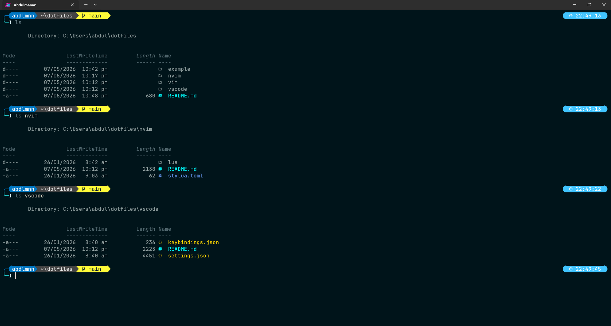
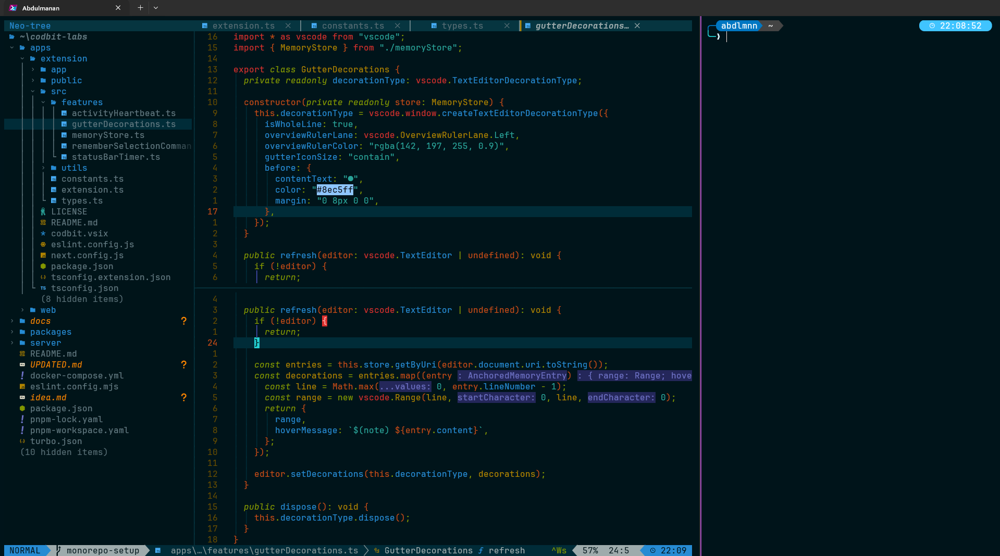
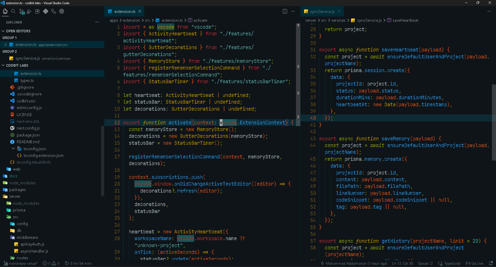
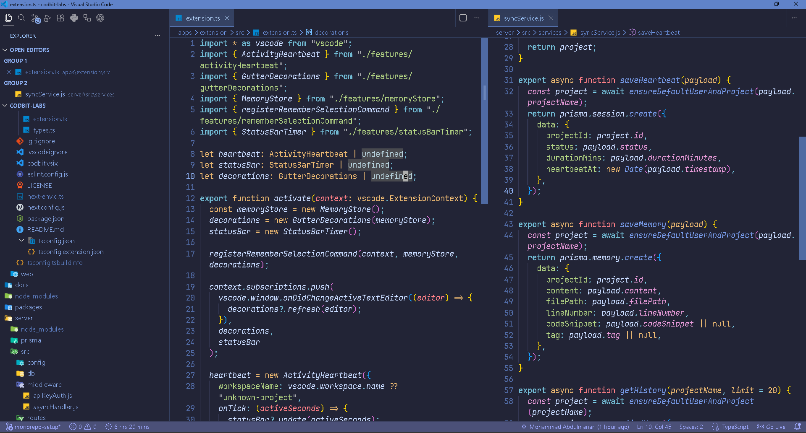

# My Setup (Windows & Linux)

This repo contains my personal setup for terminal, Neovim/Vim, and VS Code.

---

### Terminal Shell (Windows)

- I use a Linux-style terminal on Windows.
- The setup guide is inside the `nvim` folder.

---

### Neovim & Vim (Windows & Linux)

- I use LazyVim with some custom changes.
- The theme I use is Solarized Osaka.

---

### VS Code (Windows & Linux)

I use two VS Code themes.

#### Zenrized Osaka Theme

#### LazyVim Theme

